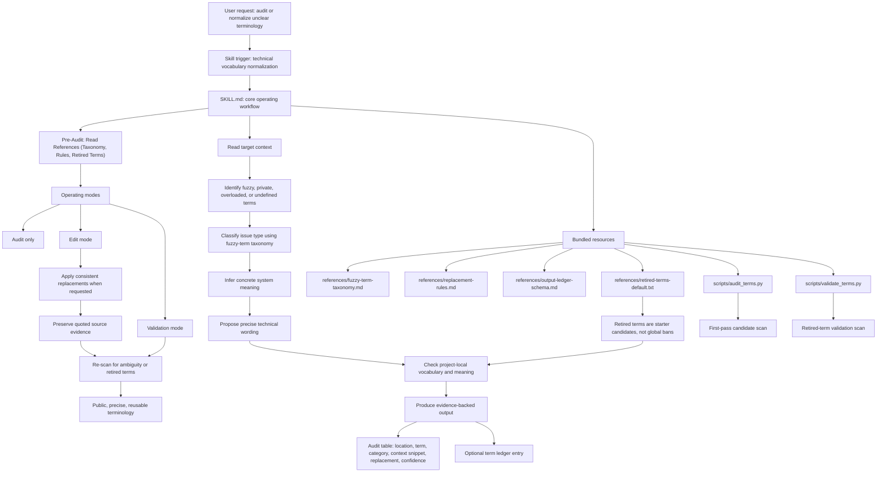

# AI Writing Helps - Agent Skills

This repository contains custom agent skills designed to improve the quality, precision, and technical accuracy of text generated by AI models.

> [!NOTE]
> This implementation is specifically made for use in **Antigravity IDE**.
> 
> Credits go to **Enid Pinxit** ([concept origin](https://x.com/EnidPinxit/status/2069528207951622165)).

## About

Rather than telling ChatGPT to stop with the fuzzy poetic terminology in our architecture ideations and making it 'a thing', this repository provides a skill for taking fuzzy vocabulary from LLM chat ideations turned into architecture and making terms and loose values technical and meaningful based on the context of the chat/architecture.

## Included Skills

### 1. Technical Vocabulary Normalizer
**Location:** `.agents/skills/technical-vocabulary-normalizer/`

**Purpose:**
Large Language Models (LLMs) often generate software architecture descriptions using fuzzy, poetic, or marketing-heavy terminology (e.g., "seamless integration layer," "magic sauce," "orchestrated symphony"). When designing software, you need precise terminology (e.g., "REST API," "algorithmic heuristic," "Kafka topic"). 

This skill translates fuzzy AI ideation language into concrete, project-specific technical terms without altering the underlying architectural logic.

**How it Works:**
The skill operates in three distinct modes:
1. **Audit Mode**: The agent scans your documentation for vague or metaphorical terms and generates a detailed Audit Table of findings without modifying the text.
2. **Edit Mode**: The agent replaces fuzzy terms with technical equivalents, requiring your explicit approval (Human-in-the-Loop) before modifying documents.
3. **Validate Mode**: The agent (or script) acts as an automated check to ensure no "retired" or hype words make it into final architectural documentation.

**Agent Chat vs Document Editing:**
By default, this skill only affects the documents the agent creates, edits, or audits when explicitly asked. It does *not* automatically filter the agent's casual conversation in the chat interface. However, because the skill is installed in the workspace, you can instruct the agent to apply these rules to all conversational responses, or enforce this globally by adding a rule to your workspace `AGENTS.md`.

**Included Python CLI Tools:**
The skill bundles standalone Python scripts that you can use locally or in your CI/CD pipelines:
- `scripts/audit_terms.py`: Scans files/folders and outputs a markdown table of fuzzy term occurrences.
- `scripts/validate_terms.py`: A strict validation script that fails (returns exit code 1) if fuzzy terms are found.

---

## Usage Examples

### Example 1: Interacting with the AI Agent
You can trigger the skill directly during a conversation with your AI assistant by asking it to run in a specific mode.

**User Prompt:**
> "Agent, please run the Technical Vocabulary Normalizer in **Audit Mode** on the architecture proposal below:
> 
> *The system leverages a magic data wrapper to seamlessly sync with the blackbox engine.*"

**Agent Output:**
> | Location | Term | Category | Proposed Replacement | Confidence |
> | :--- | :--- | :--- | :--- | :--- |
> | stdin:L1 | `magic` | Poetic/Metaphorical | `algorithmic, heuristic, rule-based` | 0.8 |
> | stdin:L1 | `wrapper` | Vague/Undefined | `adapter, decorator, facade, proxy` | 0.6 |
> | stdin:L1 | `seamless` | Poetic/Metaphorical | `automated, integrated, synchronized` | 0.7 |
> | stdin:L1 | `blackbox` | Poetic/Metaphorical | `encapsulated module, closed-source service` | 0.8 |

**Follow-up User Prompt:**
> "Agent, switch to **Edit Mode**. Let's replace 'magic data wrapper' with 'data adapter' and 'blackbox engine' with 'encapsulated module'. Rewrite the proposal."

---

### Example 2: Running the Python CLI Scripts Local & CI/CD
You can run the bundled Python scripts to audit your markdown files directly from your terminal.

**Audit a specific file:**
```powershell
python .agents/skills/technical-vocabulary-normalizer/scripts/audit_terms.py --path docs/architecture.md
```

**Audit via standard input:**
```powershell
echo "This helper leverages a magic blackbox." | python .agents/skills/technical-vocabulary-normalizer/scripts/audit_terms.py
```

**Validate documentation in a pipeline:**
```powershell
python .agents/skills/technical-vocabulary-normalizer/scripts/validate_terms.py --path docs/
```
*(If vague terminology like "robust" or "leverage" is found, the script will print the violations and exit with code `1`, allowing you to block PRs with poor architectural documentation.)*

**Advanced Options:**

Both scripts support the following advanced CLI arguments:
*   `--exclude`: Glob patterns for files/directories to exclude (e.g., `--exclude "node_modules/*" "vendor/*"`).
*   `--retired-terms`: Path to a custom retired terms text file to use instead of the default list.
*   `--skip-code-blocks` (only for `audit_terms.py`): Skips scanning text inside fenced code blocks, inline code markdown (` ` `), and blockquote prefixes (`>`) to avoid false positives in documentation examples.

**Example with advanced flags:**
```powershell
python .agents/skills/technical-vocabulary-normalizer/scripts/audit_terms.py --path docs/ --exclude "docs/archive/*" --skip-code-blocks --retired-terms my-custom-retired-terms.txt
```

# Enid Pinxit flowchart (Updated)

